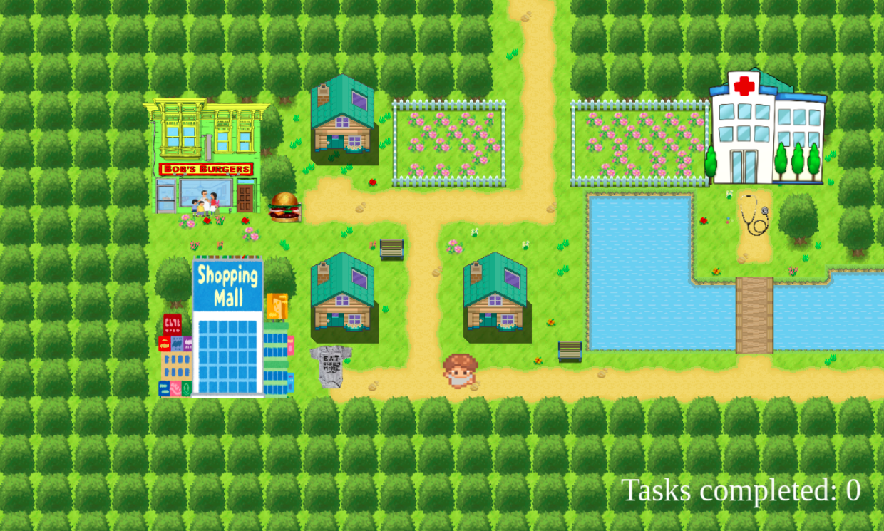

# Game name

<!-- When you finish, add a nice screenshot of your game -->

## Description

In this game the player is a father that has to carry out some tasks that his wife asked him to do while taking care his newborn son.

## User stories MVP

Minimum user stories:

- User can hit the play button to see the game screen
- User can move up, down, right and left
- User can see the tasks completed on screen
- User can see a win page when he completes the tasks
- User can select options from lists to finish a challenge

## User stories Backlog

- User can gain points after colecting designated items
- User can have the movements blocked when special challenge in encountered
- User can win the game after collecting 3 special items and defeating the challenges

## File structure

- <code>game.js</code>: contains all the elements for the game to work. Methods: start(), \_update()
- <code>player.js</code>: constructor for the player father. Methods: moveRight(), moveLeft(),moveUp(), moveDown()
- <code>tasks.js</code>: constructor for the tasks
- <code>scripts.js</code>: contains all the DOM manipulation code to start the game
- <code>assets.js</code>: contains all images and sounds present in the game
- <code>obstacles.js</code>: contains a constructor for objects where the player cannot pass

## Useful links

<!-- When you finish, add these links and commit -->

- [Presentation slides]()
file:///home/alberto/Descargas/slides-minimal%20(4).html
- [Deployed game]()
https://betoquintero.github.io/ih-project1-template/
